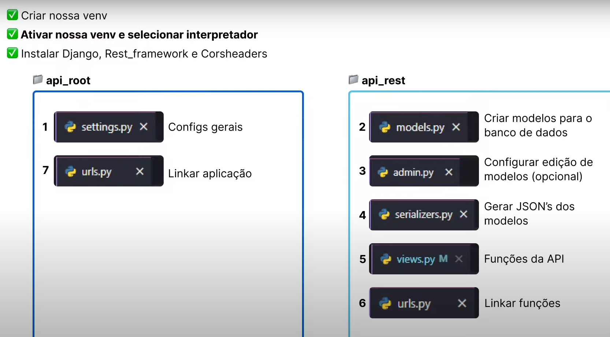

# Django API CRUD


> Uma aplicação robusta de API RESTful criada com Django, implementando operações CRUD (Create, Read, Update, Delete). Este projeto foi desenvolvido para demonstrar a criação de uma API eficiente e escalável, seguindo as melhores práticas de desenvolvimento com Django.

## Sumário

- [Visão Geral](#visão-geral)
- [Tecnologias Utilizadas](#tecnologias-utilizadas)
- [Configuração do Ambiente](#configuração-do-ambiente)
- [Estrutura do Projeto](#estrutura-do-projeto)
- [Funcionalidades](#funcionalidades)
  - [GET: Todos os Usuários](#get-todos-os-usuários)
  - [GET: Usuário por Nome:](#get-usuário-por-nome)
  - [Gerenciamento de Dados de Usuários](#gerenciamento-de-dados-de-usuários)
- [Como Executar o Projeto](#como-executar-o-projeto)
- [Contato](#contato)

## Visão Geral

Este projeto é um exemplo prático de como criar uma API RESTful utilizando Django, um framework web de alto nível e orientado por boas práticas de segurança e eficiência. A aplicação demonstra como estruturar um projeto Django para operações CRUD, criando uma base sólida para APIs em qualquer aplicação web.

Este projeto foi baseado na [aula do YouTube](https://www.youtube.com/watch?v=Q2tEqNfgIXM) que aborda a criação de uma API em Django com operações CRUD. 



## Tecnologias Utilizadas

- **Python 3.11** - Linguagem de Programação
- **Django 5.1** - Framework Web
- **Django REST Framework** - Biblioteca para construção de APIs
- **SQLite** - Banco de Dados Relacional
- **CORS Headers** - Gerenciamento de CORS

## Configuração do Ambiente

Para configurar o ambiente de desenvolvimento, siga os passos abaixo:

```bash
# 1. Clone o repositório
git clone https://github.com/alan-nunes/django-api-crud.git
cd django-api-crud

# 2. Crie e ative um ambiente virtual
python3 -m venv venv
source venv/bin/activate  # No Windows: venv\Scripts\activate

# 3. Instale as dependências do projeto
pip install -r requirements.txt

# 4. Realize as migrações para configurar o banco de dados
python3 manage.py migrate

# 5. Inicie o servidor de desenvolvimento
python3 manage.py runserver
```

## Estrutura do Projeto

O projeto segue a estrutura padrão de um projeto Django, com as seguintes modificações para suportar a API CRUD:

- **models.py:** - Define os modelos de dados

- **serializers.py:** - Responsável por serializar os modelos para JSON.

- **views.py:** - Contém as views para as operações CRUD

- **urls.py:** - Mapeia as URLs para as views correspondentes.

## Funcionalidades
- ### GET: Todos os Usuários
    - **/api** - Recupera todos os usuário.

    - **Função: get_users**

    - **Descrição:** Retorna uma lista com todos os usuários cadastrados na base de dados.


- ### Gerenciamento de Dados de Usuários
    - **Rota:** /data/

    - **Função:** user_manager

    - **Descrição:** BPermite criar novos usuários, atualizar dados de usuários existentes ou deletar usuários conforme necessário.

## Como Executar o Projeto
Para executar este projeto localmente, siga as etapas descritas na seção Configuração do Ambiente. Após iniciar o servidor de desenvolvimento, você pode acessar a API em http://localhost:8000/api


## Contatos
 - **Linkedln:** [Alan Nunes](https://www.linkedin.com/in/alan-sn/)